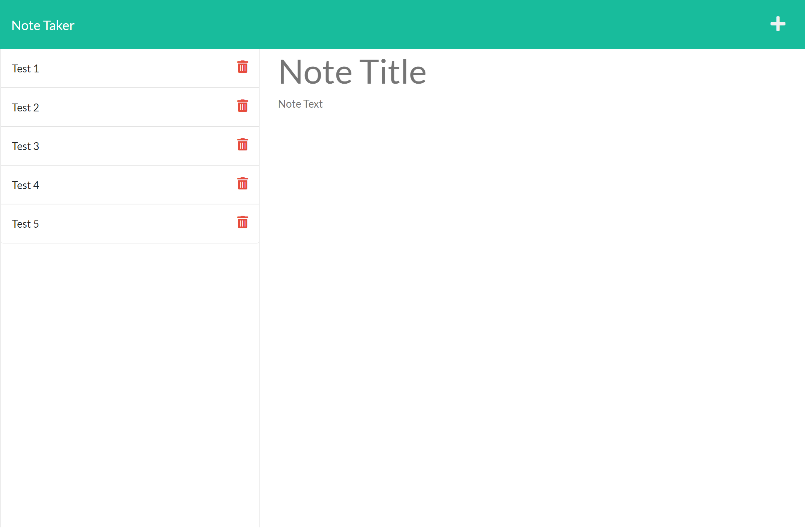

# **Note Taker**

This application lets users like small business owners to be able to write and save notes, so that they can organize their thoughts and keep track of tasks they need to complete.

App deployed url: https://sherrynotetaker.herokuapp.com/

* When you open the Note Taker, you are presented with a landing page with existing notes listed in the left-hand column, you can add your new note by entering the note's title and text in the right-hand column.

* When you enter a new note, you can save this note by clicking the Save icon appears in the navigation at the top of the page.

* When you click the Save icon, the new note you just entered is saved and appears in the left-hand column with other existing notes.

* When you click the existing note in the left column, this note details will be shown in right column.

* When a task is completed, just simply click the trash bin icon so this task will be deleted.

### Screen shot of the Note Taker app:

### Enjoy!
